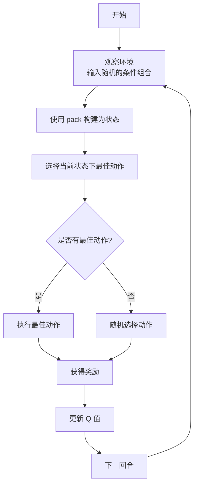

# 使用 Q-Learning 开发游戏玩法

## 1. 引言

&emsp;&emsp;欢迎来到本教程！在这里，我们将一步一步地学习如何在 Dora SSR 游戏引擎中使用 Q-Learning 强化学习算法来开发游戏玩法。即使您对机器学习和游戏开发并不熟悉，也无需担心。本教程将以通俗易懂的方式为您讲解。

## 2. 什么是强化学习和 Q-Learning？

&emsp;&emsp;**强化学习**是一种机器学习方法，它通过让智能体（agent）在环境中采取行动，从而获得奖励或惩罚，来学习如何最大化累积奖励。

&emsp;&emsp;**Q-Learning** 是一种无模型的强化学习算法。它通过学习一个状态-动作值函数 \( Q(s, a) \)，来估计在状态 \( s \) 下采取动作 \( a \) 所能获得的最大期望收益。

### 2.1 在游戏开发中应用 Q-Learning

&emsp;&emsp;在游戏中，您可以将游戏角色视为智能体，游戏环境就是角色所处的世界。通过 Q-Learning，角色可以在游戏互动过程中，逐步学习到在不同状态下采取何种行动来获得最大收益，例如击败敌人、收集道具等。

## 3. 了解 QLearner 对象

&emsp;&emsp;在 Dora SSR 引擎中，我们有一个 `QLearner` 对象，它提供了实现 Q-Learning 所需的方法。以下是主要的方法和属性：

- **pack(hints, values)**：将多个条件组合成一个唯一的状态值。
- **QLearner(gamma, alpha, maxQ)**：创建一个 QLearner 实例。
- **update(state, action, reward)**：根据奖励更新 Q 值。
- **getBestAction(state)**：获取在给定状态下的最佳动作。
- **matrix**：一个存储状态、动作和对应的 Q 值的矩阵。
- **load(values)**：从已知的状态-动作对矩阵加载 Q 值。

### 3.1 QLearner:pack() 的详细解释

#### 功能概述

&emsp;&emsp;`QLearner.pack()` 方法用于将多个离散条件组合成一个唯一的状态值。它接受两个参数：

- **hints**：一个整数数组，表示每个条件可能的取值数量。
- **values**：一个整数数组，表示当前每个条件的取值。

#### 为什么需要 pack()？

&emsp;&emsp;在强化学习中，状态通常是由多个特征组合而成的。为了方便在 Q 表中存储和查找，我们需要将这些特征组合成一个唯一的状态标识。`pack()` 方法就是实现这个功能的工具。

#### 工作原理

&emsp;&emsp;假设我们有两个条件：

1. 天气状况，有 3 种可能：晴天（0）、阴天（1）、雨天（2）。
2. 敌人数量，有 2 种可能：少（0）、多（1）。

&emsp;&emsp;因此，`hints = {3, 2}`，表示第一个条件有 3 种取值，第二个条件有 2 种取值。

&emsp;&emsp;如果当前是阴天且敌人数量多，那么 `values = {1, 1}`。

&emsp;&emsp;使用 `pack(hints, values)`，我们可以将 `values` 转换为一个唯一的状态整数。例如：

```yue
_ENV = Dora
state = ML.QLearner\pack [3, 2], [1, 1]
print state -- 输出一个整数，表示当前的唯一状态
```

#### 数学原理

&emsp;&emsp;`pack()` 方法通过对每个条件的取值进行编码，将多个条件组合成一个整数。这是通过将每个条件的取值转换为二进制数进行位操作来实现的。

## 4. 实战步骤

### 4.1 导入 QLearner 模块

&emsp;&emsp;首先，我们需要导入 `ML` 模块并创建一个 `QLearner` 实例：

```yue
_ENV = Dora
qLearner = ML.QLearner 0.5, 0.5, 100.0 -- 可以根据需要调整参数 gamma, alpha, maxQ
```

&emsp;&emsp;假设我们要让游戏角色学习在不同环境下选择合适的武器。我们的条件和动作可能如下：

- **条件（状态特征）**：
	- 环境类型（3 种）：森林（0）、沙漠（1）、雪地（2）
	- 敌人类型（2 种）：步兵（0）、坦克（1）
- **动作**：
	- 使用手枪（1）
	- 使用火箭筒（2）
	- 使用狙击枪（3）

### 4.3 使用 pack() 方法构建状态值

```yue
hints = [3, 2] -- 每个条件的取值数量
environment = 1 -- 沙漠
enemy = 0 -- 步兵
stateValues = [environment, enemy]
state = ML.QLearner\pack hints, stateValues
```

### 4.4 选择动作

```yue
action = qLearner\getBestAction state
if action == 0 -- 0 表示没有最佳动作
	-- 如果没有最佳动作，随机选择一个
	action = math.random 1, 3
```

### 4.5 执行动作并获得奖励

```yue
reward = switch action
	when 1 -- 使用手枪的逻辑
		10 -- 假设的奖励值
	when 2 -- 使用火箭筒的逻辑
		20
	when 3 -- 使用狙击枪的逻辑
		15
```

### 4.6 更新 Q 值

```yue
qLearner\update state, action, reward
```

### 4.7 循环训练

&emsp;&emsp;将上述步骤放入一个迭代循环中，让智能体不断地学习和更新策略。智能体通常的 Q-Learning 学习过程可以参考下面一个简单的流程图：



## 5. 完整的代码示例

&emsp;&emsp;下面是一个完整的 Lua 代码示例，演示如何在 Dora SSR 引擎中使用 `QLearner` 来实现简单的强化学习。这个示例将让一个智能体学习在不同的环境和敌人类型下选择最佳的武器。

```yue
-- 导入 ML 模块
_ENV = Dora

-- 创建一个 QLearner 实例，设置 gamma、alpha 和 maxQ
qLearner = ML.QLearner 0.5, 0.5, 100.0

-- 定义每个条件可能的取值数量（hints）
-- 环境类型：森林（0）、沙漠（1）、雪地（2） => 3 种
-- 敌人类型：步兵（0）、坦克（1） => 2 种
hints = [3, 2]

-- 定义动作集
-- 使用手枪（1）、使用火箭筒（2）、使用狙击枪（3）
actions = [1, 2, 3]

-- 模拟多次学习迭代
for episode = 1, 1000
	-- 随机生成当前环境和敌人类型
	environment = math.random 0, 2 -- 0: 森林, 1: 沙漠, 2: 雪地
	enemy = math.random 0, 1 -- 0: 步兵, 1: 坦克

	-- 使用 pack() 方法将当前条件组合成唯一的状态值
	stateValues = [environment, enemy]
	state = ML.QLearner\pack hints, stateValues

	-- 尝试获取给定状态下的最佳动作
	action = qLearner\getBestAction state

	-- 如果没有最佳动作，随机选择一个动作（探索）
	if action == 0
		action = actions[math.random #actions]
	else
		-- 有一定概率选择随机动作以探索新的策略（ε-贪心策略）
		explorationRate = 0.1 -- 10% 的概率进行探索
		if math.random! < explorationRate
			action = actions[math.random #actions]

	-- 执行动作并根据当前环境和敌人类型获取奖励
	reward = 0
	reward = switch action
		when 1 -- 使用手枪
			if enemy == 0 -- 对付步兵（优势）
				20
			else -- 对付坦克（劣势）
				-10
		when 2 -- 使用火箭筒
			if enemy == 1 -- 对付坦克（优势）
				30
			else -- 对付步兵（劣势）
				0
		when 3 -- 使用狙击枪
			if environment == 2 -- 在雪地环境中（优势）
				25
			else
				10

	-- 更新 Q 值
	qLearner\update state, action, reward

-- 测试学习结果
print "学习完成，开始测试..."

testScenarios =
	* environment: 0 -- 森林，对付步兵
		enemy: 0
	* environment: 1 -- 沙漠，对付坦克
		enemy: 1
	* environment: 2 -- 雪地，对付步兵
		enemy: 0

for i, scenario in ipairs testScenarios
	stateValues = [scenario.environment, scenario.enemy]
	state = ML.QLearner\pack hints, stateValues
	action = qLearner\getBestAction state

	-- 显示测试结果
	envNames = ["森林", "沙漠", "雪地"]
	enemyNames = ["步兵", "坦克"]
	actionNames = ["手枪", "火箭筒", "狙击枪"]

	print string.format "场景 %d: 环境-%s, 敌人-%s => 建议使用 %s",
		i,
		envNames[scenario.environment + 1],
		enemyNames[scenario.enemy + 1],
		actionNames[action]
```

### 5.1 代码详解

#### 1. 导入模块并创建 QLearner 实例

```yue
_ENV = Dora
qLearner = ML.QLearner 0.5, 0.5, 100.0
```

&emsp;&emsp;创建一个 QLearner 实例，设置 gamma、alpha 和 maxQ。

- **gamma**：折扣因子，影响未来奖励的权重。
- **alpha**：学习率，决定新信息对 Q 值更新的影响程度。
- **maxQ**：Q 值的最大限制，防止 Q 值无限增长。

#### 2. 定义状态特征和动作集

```yue
hints = [3, 2]
actions = [1, 2, 3]
```

&emsp;&emsp;定义每个条件可能的取值数量（hints），以及动作集。注意动作的编号最小从 1 开始。

#### 3. 进行学习迭代

```yue
for episode = 1, 1000
	-- 学习过程
```

&emsp;&emsp;通过循环模拟多个回合，让智能体在不同的状态下学习。注意这里的回合数可以设置为 1000 次，也可以根据实际情况调整，越多的回合数可以让智能体学习到更多的经验。

#### 4. 随机生成环境和敌人类型

```yue
environment = math.random 0, 2
enemy = math.random 0, 1
```

&emsp;&emsp;模拟不同的游戏场景，环境类型和敌人类型都是随机生成的，这样可以模拟出更多的场景，让智能体学习到更多的经验。当然你也可以考虑修改代码直接枚举所有可能的场景，这样可以让智能体学习到最优解的策略。但是当你的游戏场景条件的组合空间很大时，直接枚举所有的场景组合可能是不现实的。Dora SSR 提供的 QLearner 模块可以支持的场景组合空间受到 `pack` 方法的实现所限制，理论上可以支持的场景组合空间大小为 `2^64` 种（因为会将条件编码为 64 位整数的状态）。实际可能很难达到这个上限，但是当条件组合空间很大时，直接枚举所有场景组合的计算量会非常大。

#### 5. 使用 pack() 方法构建状态值

```yue
stateValues = [environment, enemy]
state = ML.QLearner\pack hints, stateValues
```

&emsp;&emsp;将当前回合随机得到的多个条件组合成唯一的状态整数，便于在 Q 表中存储和检索。

#### 6. 选择动作

```yue
action = qLearner\getBestAction state
if action == 0
	action = actions[math.random #actions]
else
	explorationRate = 0.1
	if math.random! < explorationRate
		action = actions[math.random #actions]
```

&emsp;&emsp;使用 `getBestAction(state)` 方法获取当前状态下已知的最佳动作，并使用 `ε-贪心策略`，有一定概率选择随机动作进行探索。`ε-贪心策略` 是强化学习中常用的一种策略，用于在探索和利用之间找到平衡，可以防止智能体过早收敛到局部最优解，从而可能得到更好的训练表现。

#### 7. 执行动作并获取奖励

```yue
reward = 0
reward = switch action
	when 1 -- 使用手枪
		-- 根据动作和当前状态，计算奖励值
```

&emsp;&emsp;奖励的设定根据游戏逻辑，可以调整。在实际的游戏中，奖励的计算可能还需要再等待一系列动作的执行后再判断结果，不会像这里这么简单。

#### 8. 更新 Q 值

```yue
qLearner\update state, action, reward
```

&emsp;&emsp;使用获得的奖励更新 Q 值，优化策略，让智能体在不同的状态下选择最佳的动作。并完成本回合的迭代训练。

#### 9. 测试学习结果

```yue
for i, scenario in ipairs testScenarios
	-- 测试不同的场景，查看智能体的决策
```

&emsp;&emsp;进行测试，并输出智能体在不同场景下的决策。注意因为这里是随机生成的场景，所以智能体的决策因为随机到的场景不同，可能并不能得到最佳的训练决策的结果。

### 5.2 运行结果示例

```
学习完成，开始测试...
场景 1: 环境-森林, 敌人-步兵 => 建议使用 手枪
场景 2: 环境-沙漠, 敌人-坦克 => 建议使用 火箭筒
场景 3: 环境-雪地, 敌人-步兵 => 建议使用 狙击枪
```

## 6. 总结

&emsp;&emsp;通过上述完整的代码示例，我们实现了以下目标：

- **使用 QLearner:pack() 方法**：将多个条件组合成唯一的状态值，便于在 Q 表中存储和检索。
- **构建了强化学习循环**：让智能体在不同的状态下尝试动作、获取奖励、更新策略。
- **实现了 ε-贪心策略**：在利用已知最佳策略的同时，保持一定的探索新策略的能力。
- **测试了学习效果**：通过预设的测试场景，验证智能体是否学会了选择最佳动作。

&emsp;&emsp;希望这个示例能帮助您更深入地理解如何在 Dora SSR 引擎中使用 Q-Learning 算法来开发游戏玩法。如有任何疑问，欢迎到我们的社区一起来探讨！